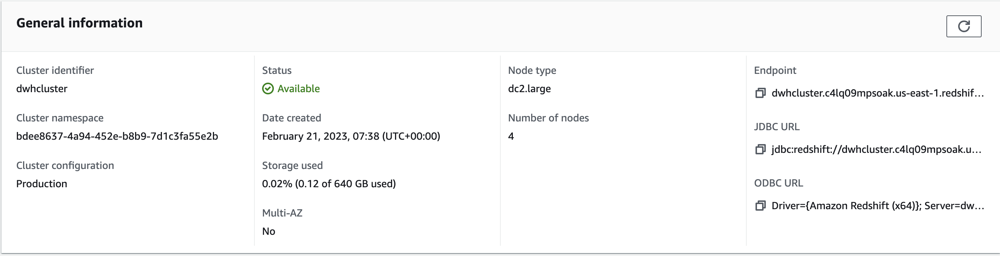
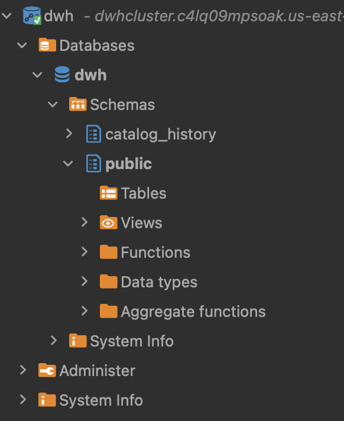
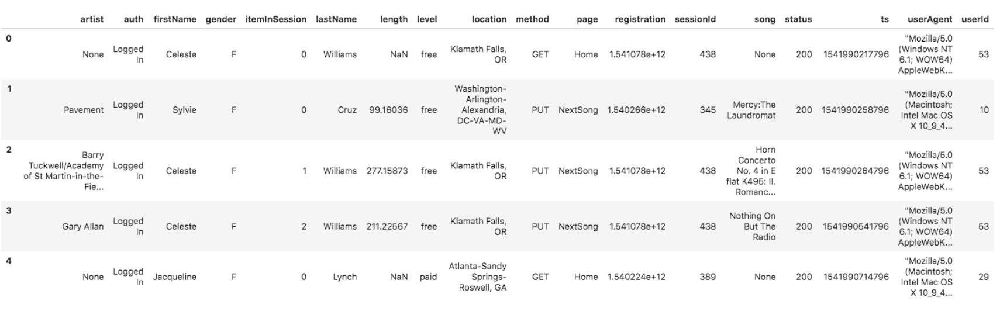
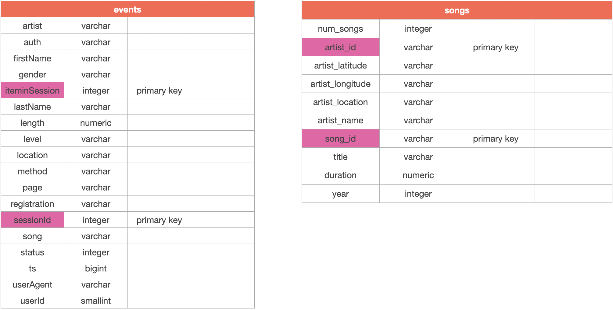
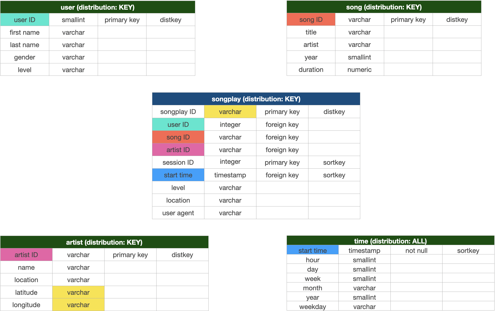
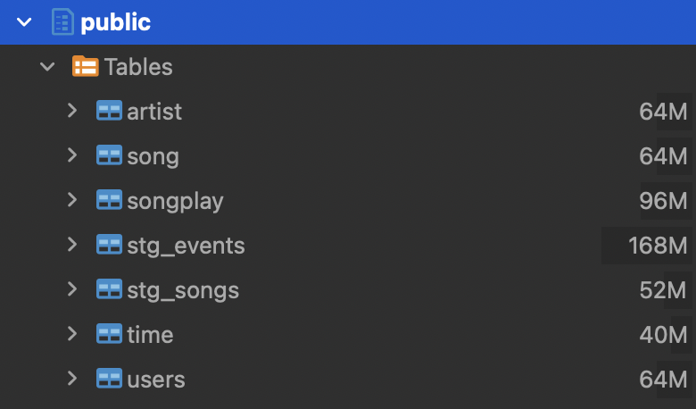
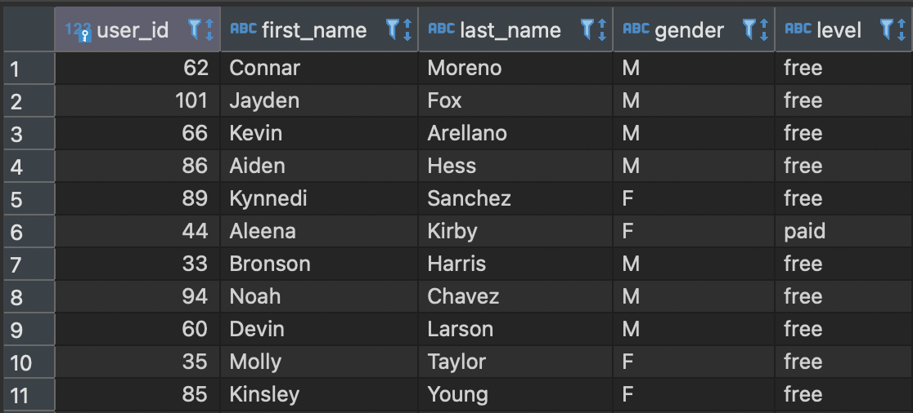

# Overview
A music streaming startup, Sparkify, has grown their user base and song database and want to move their processes and data onto the cloud. Their data resides in S3, in a directory of JSON logs on user activity on the app, as well as a directory with JSON metadata on the songs in their app.

The purpose of this project is creating a Redshift data warehouse and creating an ELT process for

- Extracting data from S3 buckets
- Loading them into staging tables
- Transforming them and creating a final schema

To run the code, you need to

1. Run `launch_cluster.py` to create the cluster
2. Run `configure_cluster.py` to update the security group
3. Run `create_tables.py` to create the tables
4. Run `etl.py` to load the staging tables and insert into the star schema
5. Run `delete_cluster.py` to delete the cluster

# The cluster
The first step in this project is to create a Redshift cluster. This is done using boto3, AWS's Python SDK. Having infrastructure configurations as code is a useful way to ensure that infrastructure configuration is maintainable, reproducible, and shareable. 

The `cluster_setup` folder contains three scripts for launching, configuring, and deleting the cluster. These are intended to be run sequentially. Cluster configurations are stored in `dwg.cfg`. 

1. `launch_cluster` will
* Create an IAM role for redshift
* Attach S3 read access to it
* Fetch the role's ARN - this is needed for creating the cluster
* Create the cluster:
    * dc2.large
    * 4 nodes

Running this script results in the cluster being created and becoming available:



2. `configure_cluster` is a separate script to be run once the cluster has been created. Its goal is to add an inbound rule to allow TCP traffic from anywhere. This is clearly highly insecure and only to be used for dev purposes.

Because it prints the endpoint and authorises ingress, we can now connect to our cluster (screenshot from DBeaver):



3. `delete_cluster` is to be run when finished with the project. It deletes the cluster and the IAM role that has been created.

# The ELT process
## The data
There are two raw datasets: songs and events.

### Song dataset
The first dataset is a subset of real data from the Million Song Dataset. Each file is in JSON format and contains metadata about a song and the artist of that song. The files are partitioned by the first three letters of each song's track ID. For example, here are file paths to two files in this dataset.

```
song_data/A/B/C/TRABCEI128F424C983.json
song_data/A/A/B/TRAABJL12903CDCF1A.json
```

And below is an example of what a single song file, TRAABJL12903CDCF1A.json, looks like.

```
{"num_songs": 1, "artist_id": "ARJIE2Y1187B994AB7", "artist_latitude": null, "artist_longitude": null, "artist_location": "", "artist_name": "Line Renaud", "song_id": "SOUPIRU12A6D4FA1E1", "title": "Der Kleine Dompfaff", "duration": 152.92036, "year": 0}
```

### Log dataset 
The second dataset consists of log files in JSON format generated by an event simulator based on the songs in the dataset above. These simulate app activity logs from an imaginary music streaming app based on configuration settings. The log files are partitioned by year and month. For example, here are file paths to two files in this dataset.

```
log_data/2018/11/2018-11-12-events.json
log_data/2018/11/2018-11-13-events.json
```

Below is an example of what the data in a log file, `2018-11-12-events.json`, looks like.



When Redshift needs to read JSON data into a table, you can either rely on it to use the top-level key as the value to be read in, or you can provide a file, known as a JSON paths file, stating explicitly which key needs to go into which field. This accompanying `log_json_path.json` file is also stored in S3.

## Extracting the data
Before we read in the data, we need to consider the schema. 

### Staging tables
First, we'll extract the data into two staging tables, `stg_songs` and `stg_events`. They look like this:



### Star schema and distribution styles
Now, we can do some data modelling and create a warehouse-style star schema. 



We will have one fact table, marked in blue, `songplay`, which contains the raw events. 

Then there will be dimension tables, marked in green, around it, containing further information about 
* artists
* songs
* users
* the time when a song was played

A key aspect of Redshift is that we are able to choose sortkeys and distribution styles in order to optimise the cluster's performance.

A **distribution key** decides how the data is distributed across nodes. 

In this case, we'll choose the distribution style ALL for the time table, as this is likely to be a small table and will be joined on often in analytical queries. This is why it will be performant to have it stored on all nodes, but not too onerous (because it's small). 

All other tables have distribution style KEY, meaning they will be partitioned by one or more keys and spread across nodes. I've chosen the ID column of each as the distribution key on the assumption that this will result in a relatively even spread of data across nodes, and that these tables will likely be, or become, too big to be stored on each node.

Using KEY means that rows with similar values on that field will be placed on the same slice.

I have not tested whether this is more performant than EVEN or AUTO, that would be a useful next step.

A **sort key** decides the order in which data is stored on the nodes. I've only chosen sortkeys in fields that (may) have a meaningful time dimension, as this is likely to be used to sorting in analytical queries. These are `start_time` in the times table and the `session_id` and `start_time` in the songplays table. 

To create our tables, we run `create_tables.py`. All SQL required for this project is in `sql_queries.py`. 

### The COPY command
In order to extract the data from S3, we'll use Redshift's COPY command to copy data into a table. 

To do so, we need to supply (a full list of optional arguments can be found online)
* The table to copy into
* A source, namely a file in S3
* An IAM role with S3 read access
* In the case of the events data, a JSON paths file 
* A region where the S3 bucket is

A COPY command may look like

```
COPY stg_events
FROM 's3://udacity-dend/log_data'
IAM_ROLE 'arn:aws:iam::012345678910:role/dwhRole'
JSON 's3://udacity-dend/log_json_path.json'
REGION 'us-west-2'
```

We run these commands to load the data from S3 into our staging tables.

## Loading and transforming the data
Now that the data is in our staging tables, we need to load it into our final schema. We can do this with insert statements, where we select from staging tables and insert the resulting rows.

`etl.py` takes care of both loading in the staging tables and running the insert statements to create the final schema. Once we run it, all our tables will be populated:



We can also inspect our tables to see that the process has worked, for example, the users table:



# Final thoughts
We now have a data warehouse to run analytics on!

Some queries we could run: 

- What's the most played song? 
- Who is the most popular artist?
- Who are the 10 most active users?

